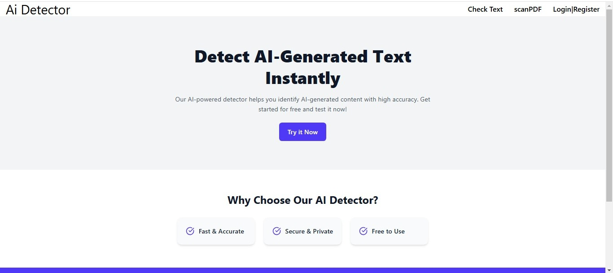

# AI Text Detector

## Présentation

AI Text Detector est une application Web qui permet aux utilisateurs de détecter du texte généré par l'IA à partir de diverses sources. Elle prend en charge les téléchargements de fichiers PDF et l'authentification des Utilisateurs. L'application est conçue avec Laravel (backend) et React (frontend) en utilisant MySQL pour le stockage des données.

## Fonctionnalités

### **Fonctionnalités principales**
- **Détection de texte générée par l'IA**: analysez le texte saisi pour déterminer s'il est généré par l'IA.
- **Utilisation limitée gratuite**: les nouveaux utilisateurs peuvent tester la fonction de détection de l'IA n'importe quelle fois mais pour scanner des Pdf l'authentification sera requise.
- **Importer PDF**:
  - Upload PDF files containing text for AI analysis.
  - Téléchargez des fichiers PDF contenant du texte pour une analyse par l'IA.
  - Extraire du texte à partir de PDF à l'aide de **smalot/pdfparser** dans Laravel.

- **Authentification et gestion des utilisateurs :**:

  - Connexion et inscription sécurisées.
  - Contrôle d'accès basé sur les rôles pour les utilisateurs et les administrateurs.

### **Frontend (React)** 
- **React Router DOM** pour la navigation.
- **Tailwind CSS** pour la conception des interfaces.
- **Système de téléchargement de fichiers** utilisand `useForm` de `react-hook-form` et `axios`.
- **Traitement PDF**:
  - Téléchargez des fichiers PDF et envoyez-les au backend.
  - Affichez le texte extrait et autorisez l'exportation des résultats.

### **Backend (Laravel)**
- **API Routes dans `api.php`** pour gérer les requêtes.
- **MySQL Base De Donee** pour stockage des donnee.
- **PDF Text Extraction** a l'aide du package `smalot/pdfparser`.
- **Algorithme de détection de texte IA** (l'intégration avec l'API OpenAI gpt-3.5-turbo).


### **


## Installation & Setup
### **Requirements**
- Node.js & npm
- PHP 8 & Composer
- MySQL & MongoDB
- Laravel 10

### **Backend (Laravel)**
1. Clone the repository:
   ```bash
   git clone https://github.com/yourusername/ai-text-detector.git
   cd ai-text-detector/backend
   ```
2. Install dependencies:
   ```bash
   composer install
   ```
3. Configure environment variables:
   ```bash
   cp .env.example .env
   php artisan key:generate
   ```
4. Set up database:
   ```bash
   php artisan migrate
   ```
5. Serve the application:
   ```bash
   php artisan serve
   ```

### **Frontend (React)**


## Contributors
- **Ameur**
